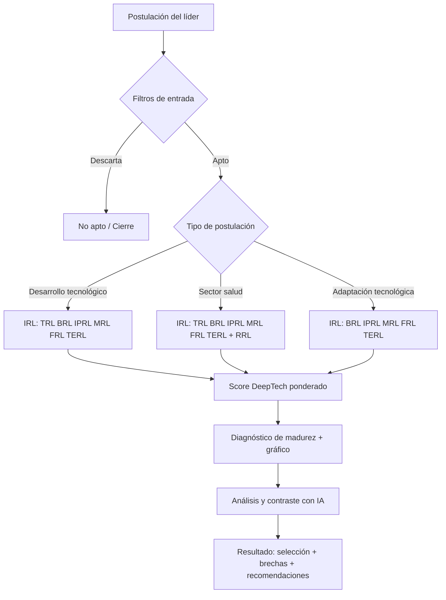

# Proceso de selección y evaluación DeepTech — Universidad del Rosario

## Flujo (Mermaid)

## Pasos

### 1. Formulario de postulación

El líder completa datos de equipo, modelo de negocio e innovación/tecnología.

### 2. Variables básicas que descartan la selección de entrada

Filtros binarios de elegibilidad. Si se cumple alguna condición de descarte, la postulación no avanza.

**Criterios de descarte:**
- El investigador o profesor no tiene vínculo con la universidad
- Solo ideas/conceptos (sin prototipos ni productos mínimos viables)
- Tiene más de 3 años con operación comercial
- No adapta tecnología ni tiene un desarrollo tecnológico que soporte el futuro emprendimiento

### 3. Clasificación del tipo de postulación

Define qué dimensiones KTH IRL se miden según el perfil del proyecto.

- **Desarrollo tecnológico / Resultado de investigación** → dimensiones: TRL, BRL, IPRL, MRL, FRL, TERL
- **Desarrollo tecnológico del sector salud** → dimensiones: TRL, BRL, IPRL, MRL, FRL, TERL, RRL
- **Adaptación tecnológica** → dimensiones: BRL, IPRL, MRL, FRL, TERL

### 4. Cálculo del score DeepTech

Ponderación por bloques: Equipo de trabajo, Modelo de negocio, Innovación/Tecnología.

### 5. Medición de niveles de madurez (KTH IRL)

Gráfico de diagnóstico con puntos principales a desarrollar. Análisis y contraste con IA entre autoevaluación y evidencia del formulario.

### 6. Análisis y contraste con IA

La IA contrasta texto libre (problema, propuesta de valor, tecnología, competencia, innovación) con niveles declarados y con conocimiento externo.

### 7. Resultado: selección + diagnóstico

Score ponderado, perfil IRL, brechas prioritarias y recomendaciones de desarrollo.

## Dimensiones KTH IRL

| Código | Nombre | Notas |
|--------|--------|-------|
| TRL | Technology Readiness | Solo desarrollo tecnológico (no adaptación pura) |
| BRL | Business Readiness | Todas las tipologías |
| IPRL | Intellectual Property Readiness | Todas |
| MRL | Market Readiness | Todas |
| RRL | Regulatory Readiness | Solo sector salud |
| FRL | Financial Readiness | Todas |
| TERL | Team Building Readiness | Todas |

## Archivos JSON para IA

| Archivo | Contenido |
|---------|-----------|
| `herramienta_deeptech_rosario.json` | Master completo |
| `postulacion.json` | Formulario + niveles + flags IA |
| `diagnostico_kth_irl.json` | Niveles por dimensión |
| `score_deeptech.json` | Pesos por variable |
| `proceso_seleccion_deeptech.json` | Flujo y tipos |
| `imagenes_descripciones.json` | Logos + fotos PPT + alt text |
